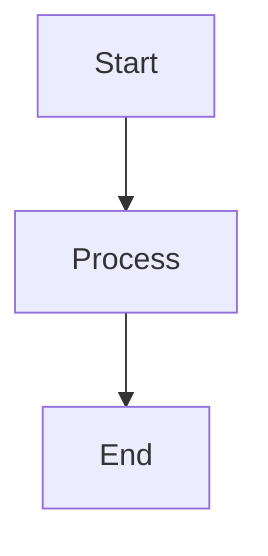

# Diagram Generation Scripts

This directory contains scripts for automatically generating PNG images from Mermaid diagram files (`.mmd`) during the build process.

## How it works

1. **Source**: Mermaid diagrams are stored in `src/diagrams/` as `.mmd` files
2. **Output**: PNG images are generated in `public/images/` maintaining the same directory structure
3. **Build Integration**: Diagrams are automatically generated before each build

## Usage

### Automatic (Recommended)
Diagrams are automatically generated when you run:
```bash
npm run build
```

### Manual Generation
To generate diagrams manually:
```bash
npm run generate-diagrams
```

### Development
During development, you can generate diagrams without building:
```bash
npm run generate-diagrams
```

## File Structure

```
src/diagrams/
├── blog/
│   └── post-1/
│       └── site-architecture.mmd
└── [other diagrams...]

public/images/
├── blog/
│   └── post-1/
│       └── site-architecture.png
└── [generated PNG files...]
```

## Scripts

### `generate-diagrams-simple.js` (Default)
- Uses `@mermaid-js/mermaid-cli` for diagram generation
- Command-line based, no browser dependencies
- Uses local project dependencies only

## Dependencies

- `@mermaid-js/mermaid-cli`: Mermaid command-line interface (local dependency)

## Troubleshooting

### Diagram not generating
1. Check that your `.mmd` file has valid Mermaid syntax
2. Ensure the file is in the `src/diagrams/` directory
3. Run `npm run generate-diagrams` to see detailed error messages

### CLI not found
If you get "mmdc not found" errors:
```bash
npm install
```

The script uses local dependencies, so no global installation is required.

## Example

Create a diagram file `src/diagrams/blog/post-1/my-diagram.mmd`:


Run the build:
```bash
npm run build
```

The PNG will be generated at `public/images/blog/post-1/my-diagram.png` and can be referenced in your blog posts as:
```markdown

``` 