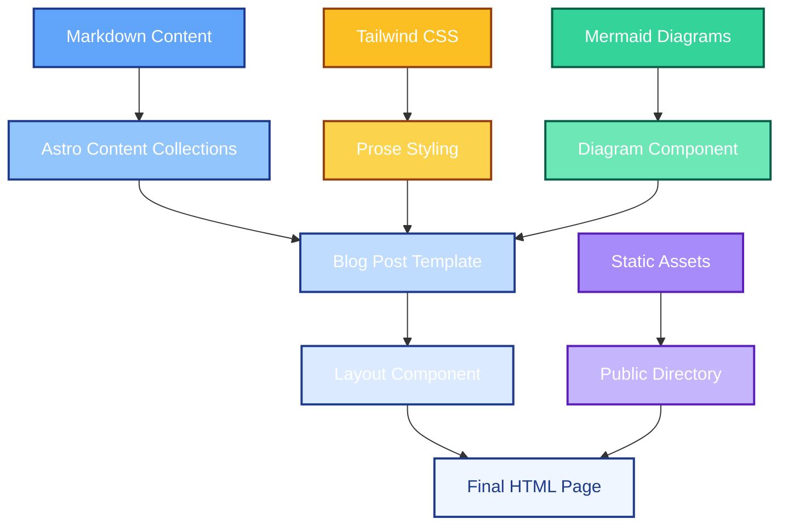
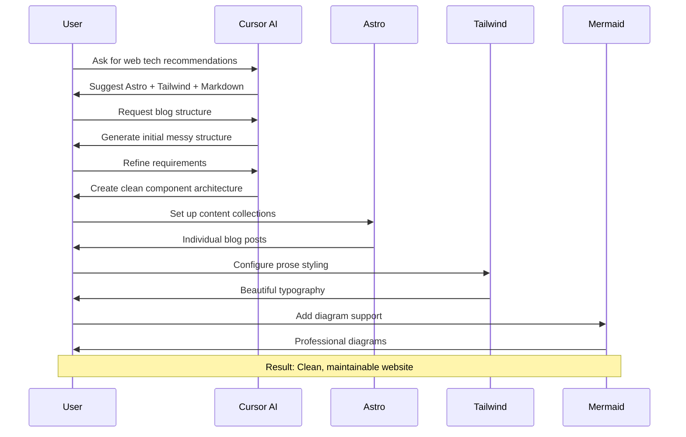

# Building a Modern Website with Cursor AI

I started by asking Cursor AI for recommendations on modern web technologies. Having used Jekyll previously, I wanted something similar - easy to edit, no CMS, and lightweight. The proposed solution was:

- **Astro framework** - Modern static site generator
- **Tailwind CSS** - Utility-first styling
- **Markdown templates** - Simple content management

---

## The Initial Challenge

The first version generated by Cursor was a messy blog structure with all content hardcoded in a single file. I refined my requirements to Cursor:

- Individual blog posts in separate files
- Clean component architecture  
- Separation of content from styles
- Type-safe content management

Much better!

### Add support for Markdown templates.

Moved from a single messy markdown file to a clean content structure.
Implemented Astro's content collections for robust content handling:
- Individual post pages at `/blog/[slug]`
- Automatic generation from markdown files
- Clean URLs and SEO-friendly structure
- Category filtering and tag management

```
src/content/blog/
├── building-a-website-using-cursor-ai.md
└── [future posts...]
```

Each post includes proper frontmatter:

```markdown
---
title: "Post Title"
excerpt: "Brief description"
date: "2025-01-15"
readTime: "5 min read"
tags: ["Tag1", "Tag2"]
featured: false
---
```

### Styles

The Markdown post styling was ugly :/ Need to fix that. 


First, I asked Cursor to explain the styles used in Markdown. I wanted to understand how styles are organized.

✅ Styles fixed with just a 1 prompt! 🎨✨


## Add a diagram
Finally, I want my blog to contain nice diagrams. Content with diagrams is so much more professional!
Let's add a diagram showing how this page is constructed.

Oh shoot! Not so easy. The idea to embedd Marmaid inside a Mardown inside Astro template. Might be too much. Going back and forth with Cursor. It claims it knows, but apparently it does not work. And applying few solutions, one even worked somehow, but it's hard to get back to it :/






## Lessons Learned

1. **AI Assistance**: Cursor AI excels at generating boilerplate and structure
2. **Iterative Development**: Build incrementally and refine continuously

---

## Conclusion

Building this website with Cursor AI and Astro demonstrated the power of modern development tools. The combination of AI assistance, static site generation, and component-based architecture resulted in a clean, maintainable, and performant website.
